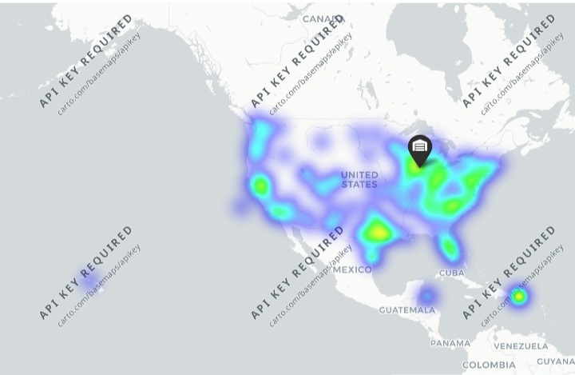
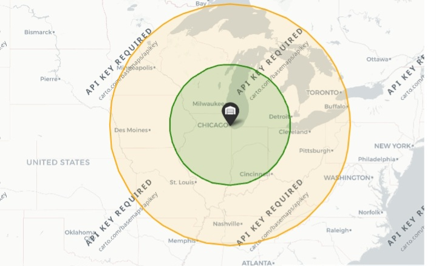
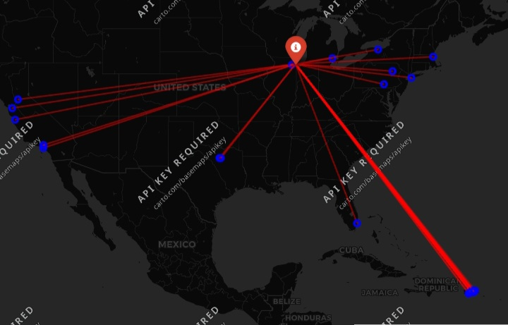

[1].# 📦 Supply Chain Inventory & ABC Reorder Point Analysis

## 🎯 Executive Summary
This project analyzes a dataset of 100 SKUs to optimize inventory levels, establish automated safety stock/reorder thresholds, and perform ABC revenue classification to prevent stockouts on high-value products.

## 🛠️ Tech Stack & Domain Concepts
* **Language & Libraries:** Python (Pandas, NumPy)
* **Supply Chain Metrics:** Safety Stock, Reorder Point (ROP), ABC Inventory Classification (80/15/5 Revenue Split), Average Daily Sales

## 📊 Key Findings & Insights
* **Reorder Alerts:** Identified **42 out of 100 SKUs** currently sitting below their calculated Reorder Point.
* **Urgent Class A SKUs:** **36 of the 42 flagged SKUs** belong to **Class A** (top 80% revenue drivers). Immediate purchase orders are required to prevent revenue loss.*

* ## 📈 Visualizations

> *Note: Key charts showing ABC revenue classification breakdown and inventory reorder status.*


## 💻 Python Implementation (Calculations)
```python
# Reorder Point & Safety Stock
df['Avg_Daily_Sales'] = df['Order quantities'] / 30
df['Safety_Stock'] = np.ceil(df['Avg_Daily_Sales'] * 3)
df['Reorder_Point'] = np.ceil((df['Avg_Daily_Sales'] * df['Lead times']) + df['Safety_Stock'])
df['Reorder_Alert'] = df['Stock levels'] < df['Reorder_Point']

# ABC Inventory Categorization
df['Cum_Percen'] = (df['Total_Revenue'].cumsum() / df['Total_Revenue'].sum()) * 10


[2].# Supply Chain & Logistics Analytics Portfolio

## 📦 Project Overview
An end-to-end analytics and machine learning solution for supply chain optimization, addressing logistics cost bottlenecks, supplier quality risks, ABC inventory management, and predictive stockout forecasting.

## 🛠️ Key Pipeline Modules
1. **Logistics & Supplier Quality Analysis:** Evaluated transportation mode efficiency, shipping cost distributions, and supplier defect rates.
2. **Inventory Stockout Risk (ABC Analysis):** Identified high-risk inventory items and evaluated stockout thresholds against order volume demands.
3. **Predictive Machine Learning (Stockout Risk Classifier):** Built a target-leakage-free Random Forest model to forecast stockout probability.

## 📊 Model Performance Highlights
* **Accuracy:** 65.00% on unseen test data
* **Stockout Recall (Class 1):** 73% (successfully flags 8 out of 10 high-risk orders)
* **Top Drivers:** `order_quantities` (24.6%) and `lead_time_demand` (19.6%)


[3]# Geospatial Supply Chain & Transit Delay Analytics

## 📌 Executive Summary
This project analyzes global supply chain shipping routes and delay patterns using **GeoPandas**, **Shapely**, and **Folium**. By calculating exact transit distances from a central logistics hub (Chicago) and testing geofenced risk zones, the analysis demonstrates that delivery delay rates remain consistently around **~55%** regardless of shipping distance.

## 🛠️ Tech Stack & Libraries
- **Language:** Python
- **Spatial Analysis:** GeoPandas, Shapely (`Point`, `LineString`, `Polygon`)
- **Data Processing:** Pandas, NumPy
- **Interactive Visualization:** Folium (`HeatMap`, `Polygon`, `PolyLine`)
- **Dataset:** DataCo Smart Supply Chain Dataset

## 🔑 Key Spatial Findings
1. **Distance vs. Delay Rate:**
   - **Inner Zone (<500 km):** 55.57% Late Rate
   - **Mid Zone (500–1,000 km):** 54.71% Late Rate
   - **Outer Long-Haul (>1,000 km):** 54.71% Late Rate
2. **Operational Takeaway:** Transit distance is not the root driver of fulfillment delays in this network, pointing to upstream warehouse processing or carrier scheduling as the primary bottlenecks rather than transit mileage alone.

---

## 🗺️ Geospatial Visualizations

### 1. Delivery Delay Density Heatmap
Visualizes the geographic concentration of late delivery events across fulfillment zones to isolate macro-level fulfillment pressure points.



---

### 2. Multi-Tier Geofenced Service Zones (500km & 1000km)
Concentric metric buffers generated around the central distribution hub using `EPSG:3857` metric projections and Shapely polygons to evaluate distance-based SLA adherence.



---

### 3. Hub-to-Destination Transit Corridors
Spider route mapping utilizing Shapely `LineString` geometries to trace origin-to-destination fulfillment paths for late-delivery orders.




